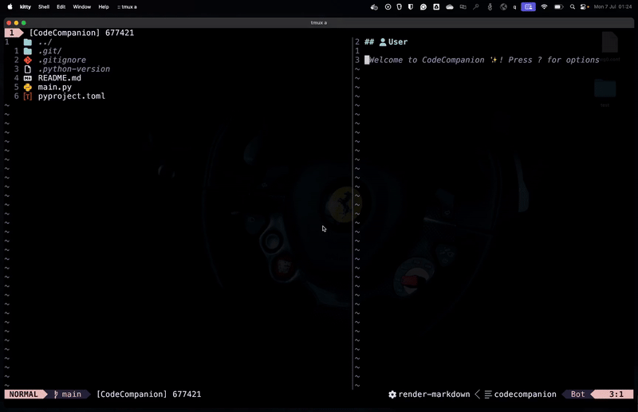

# 🌀 CodeCompanion Spinner

## 📖 Overview

Inline spinner for
[CodeCompanion](https://github.com/olimorris/codecompanion.nvim) in Neovim.

This plugin adds an animated spinner in the CodeCompanion chat while AI is
processing a request, giving clear feedback to the user.



Note the *"Processing..."* virtual text while AI is generating the response.

## ✨ Features

- 🌀 Animated spinner in CodeCompanion chat during AI processing.
- 🗂️ Supports multiple chats with concurrent active requests (each gets its
  own spinner).
- ⚙️ Zero configuration.

## 📦 Installation

Using [lazy.nvim](https://github.com/folke/lazy.nvim):

```lua
{
    "franco-ruggeri/codecompanion-spinner.nvim",
    dev = true,
    lazy = true,
    dependencies = {
        "olimorris/codecompanion.nvim",
        "nvim-lua/plenary.nvim",
    },
    opts = {}
}
```

If you use another plugin manager, make sure to call:

```lua
require("codecompanion-spinner").setup()
```

## 🙏 Acknowledgements

Thanks [yuhua99](https://github.com/yuhua99) for providing the [spinner logic](https://github.com/olimorris/codecompanion.nvim/discussions/640#discussioncomment-12866279).
